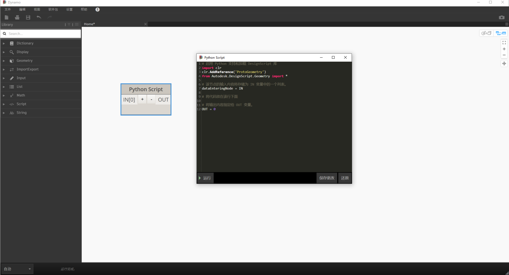

# 1.1 Dynamo's Python编辑器

## Dynamo的Python脚本编辑器

*Python* 脚本节点随 *Dynamo* 一起安装，并且在许多方面，它与任何其他节点一样：可以放置在工作空间中，重命名并可以接受任意数量的输入。

但是，与其他节点不同，如果右键单击并选择 **Edit..** 则会出现一个脚本编辑窗口(双击节点)，如下所示：

在此窗口中，您可以编写 **IronPython** 脚本，这些脚本将作为Dynamo定义的一部分直接执行。要保存脚本，请单击 **保存更改** 按钮，然后保存其中的Dynamo定义。否则，请单击“取消”按钮以放弃所做的任何更改。

## 如何编写程序

使用 *Dynamo* 编写 *Python* 代码！后面会学习设置样板代码，引用 **Revit Api**。

[dynamo手册](https://primer.dynamobim.org/)
