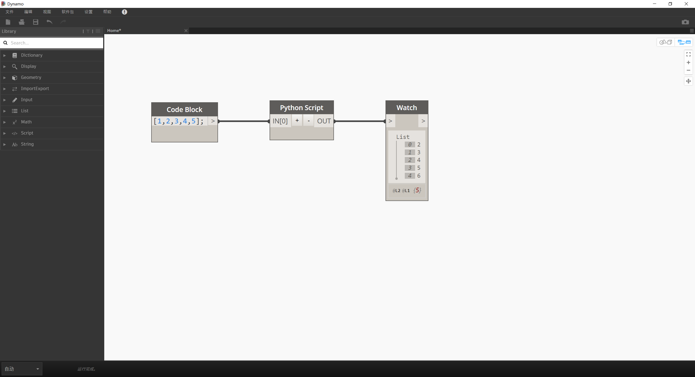
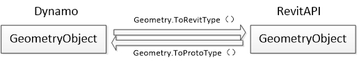

# 1.3 基本：输入和输出

## 输入和输出

**IN** 和 **OUT**  是Dynamo的Python节点中的重要关键字。**IN** 关键字告诉节点引用通过其输入发送到节点的任何数据。

+ 注意：后面所有的程序代码均运行在模板文件代码块内

通过它们的索引可以访问各种输入，例如下面的 list_of_numbers：

```python
input_list_of_numbers = IN[0] # 获取外部节点输入
output_list_of_numbers = []   # 创建空列表作为输出的内容

for number in input_list_of_numbers:
    new_number = number + 1
    output_list_of_numbers.append(new_number)

OUT = output_list_of_numbers # 输出新的列表内容（传入的值每个数字均进行 +1 操作）
```

在此示例中，我们最初为输出创建一个空列表。我们遍历输入列表中的每个数字，并将其进行 +1 操作后添加到我们创建的输出列表中。最后，通过 **OUT** 关键字输出列表。

实际上，它看起来像这样：



## 输入和输出的类型

Dynamo节点可以将任何种类的数据作为输入，并可以输出任何种类的数据作为输出。

它能够将元素（例如Revit元素），抽象数字，字符串，Dynamo几何图形以及其他所有内容作为输入。

但是，将Revit元素输入到Python节点时有一个警告。

Revit元素需要进行转换类型后，才能通过API进行访问。

----



了解 **Dynamo Revit** 数据类型转换
