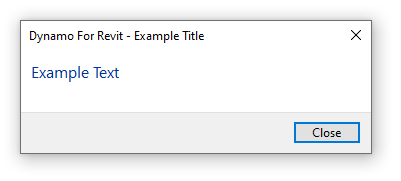
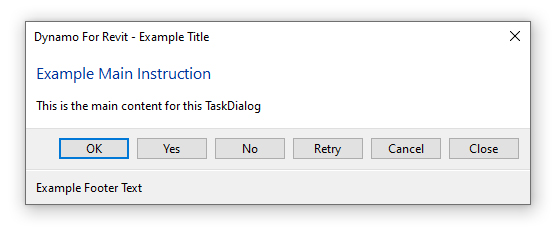

# 2.13 提示TaskDialog

## 创建 TaskDialog

**TaskDialogs** 是Revit中的用于提供详细的用户反馈API类。它们可以用一行代码执行，如下所示：

```python
TaskDialog.Show("Example Title", "Example Text")
```

TaskDialogs可用于向用户提供一定程度的反馈，可能时想报告脚本是成功运行还是遇到什么错误等情况。



---

## 自定义 TaskDialog

TaskDialog也可以通过类的属性对其进行编辑，以使内容更加丰富，例如：

```python
task_dialog = TaskDialog("Example Title")
task_dialog.CommonButtons = TaskDialogCommonButtons.Cancel | TaskDialogCommonButtons.Ok | TaskDialogCommonButtons.Close |     TaskDialogCommonButtons.No | TaskDialogCommonButtons.Yes | TaskDialogCommonButtons.Retry | TaskDialogCommonButtons.None
task_dialog.FooterText = "Example Footer Text"
task_dialog.MainInstruction = "Example Main Instruction"
task_dialog.MainContent = "This is the main content for this TaskDialog"

task_dialog.Show()
```

提示窗口样式


