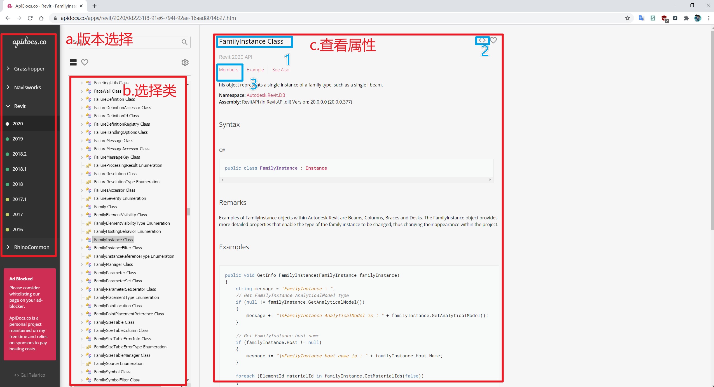

# 2.2 如何阅读Revit的API文档

## 使用 APIDocs.Co

由于该网站对于希望熟悉Revit API的人来说是非常宝贵的资源，因此我们提供了使用该网站的简要指南。



---

典型的工作流程将涉及确保已为要使用的产品选择合适版本的API（在左窗格中），然后在API文档中搜索您关注的相关主题。
例如，如果要了解有关 **FamilyInstance** 类的更多信息，只需在搜索栏中搜索它，然后从自动完成选项中选择它即可。然后，有关此类的详细信息将显示在右侧的详细信息窗格中：

1. 这是您正在查看的页面的名称。Revit API有超过22,000页，但其中的大部分都是不经常使用的！
2. 这个 **&lt;&gt;** 按钮将在几个流行的Github存储库中搜索有关该类的任何代码示例。
3. **Members** 将带您到显示该类的所有方法，属性，接口或构造函数的整个页面。

### 面向对象编程

**Members:** 类的成员页面只是将其所有方法，属性等收集在一个页面上。如果不确定某个类是否具有特定功能，这将非常有用。

**Methods:** 类方法是它可以运行的功能。可以将它们视为动词 **do something** 的实例可以做什么。例如，FamilyInstance类型的对象具有 **flipHand()** 方法，可让您翻转其处理方式。

```python
# 可是使用 flipHand 翻转 my_family_instance 实例对象
my_family_instance.flipHand()
```

* 注意：对Revit文档所做的任何更改都必须在开始事务 **Transaction** .

**Properties:** 属性更像是类的"形容词"，可帮助您了解有关该类特定对象（即实例）的更多状态。例如，FamilyInstance类具有一个 **HandFlipped** 属性，可以查询该属性的值，反应了该特定实例的是否已翻转。

```python
# 这将返回True或False，具体取决于对象是否翻转
is_it_handflipped = my_family_instance.HandFlipped
```

**Constructors:**

API中的构造函数实际上是在告诉您如何创建类的实例。例如，XYZ类用于在Revit中定义点。我们可以使用其构造函数来创建一个新的，如下所示：

```python
# 创建一个新的点
my_point = XYZ(0,0,0) 
```

* 注意：与Dynamo不同的是Revit创建的几何对象是不可见的

**Enumerations:**

这些也称为枚举，它们是硬编码的列表，通常不打算更改并且将选择限制为一组选项。交通信号灯状态的枚举应类似于：

* Red
* Yellow
* Green

因此，用户创建的任何交通信号灯对象都需要将其交通信号灯状态设置为软件供应商定义的预写状态之一。您可以选择枚举值，如下所示：

```python
# enum枚举中的一种预定义状态
traffic_light_value = TrafficLightState.Green
```

---

Revit API 中的一些关键的枚举类型：

* **BuiltInCategory**  : 类型
* **BuiltInParameter** : 参数
* **DisplayUnitType**  : 单位
