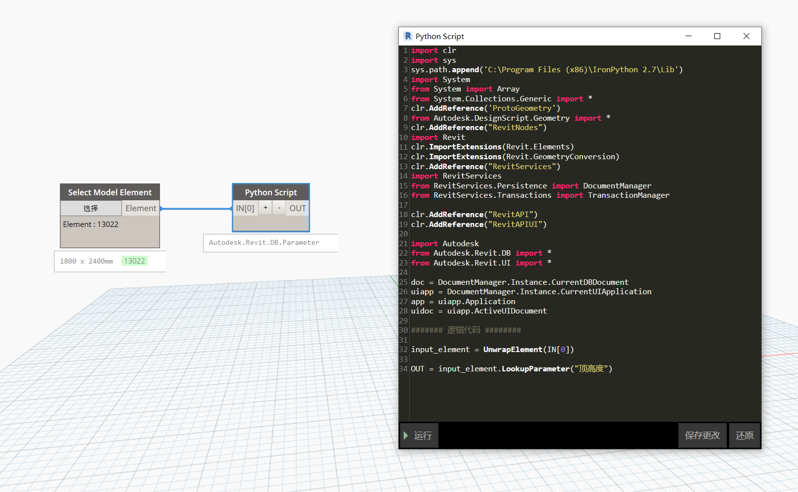

# 2.7 访问图元参数 Parameters

## 族、族类型、族实例之间的关系

Revit的族系使用族类型和族实例之间的层次关系。API中并行存在相同的关系：

* **族实例** 是Revit的 **FamilyInstance** 类的实例。例如：项目中创建的门、窗
* **族类型** 是Revit的 **FamilyType** 类的实例。例如：防火门FM1822类型

---

族实例参数通过 **FamilyInstance** 对象访问，而族类型的参数通过实例的 **FamilyType** 类型对象访问。

> 包含关系：**FamilyInstance -> FamilyType -> Family**

每个*FamilyInstance*都是通过*FamilyType*创建。同样，每个*FamilyType*将由项目文档中的加载的*Family*族文件定义。

下面演示如何从*FamilyInstance*向上找到*FamilyType*类型，再通过*FamilyType*找到*Family*族：

```python
family_instance = UnwrapElement(IN[0])         # 展开dynamo图元得到Revit族实例
family_type_id = family_instance.GetTypeId()   # 获取族实例的类型Id
family_type = doc.GetElement(family_type_id)   # 通过类型Id获取族类型
family = family_type.Family                    # 通过类型获取族Family
OUT = family_instance, family_type, family     # 输出 [族实例, 族类型, 族]
```

反方向查找：*Family*对象通常包含多个的*FamilyType*对象之间存在多对一的关系。同样，有许多放置相同*FamilyType*的*FamilyInstances*。要获得一个家庭的所有family_type，我们可以使用：

```python
family = UnwrapElement(IN[0])                                    # 展开dynamo图元得到Revit族
family_type_ids = family.GetFamilySymbolIds()                    # 获取族包含的所有类型Id
family_types = [doc.GetElement(id) for id in family_type_ids]    # 获取所有的族类型存再列表中
OUT = family_types                                               # 输出族类型列表
```

寻找特定类型的所有*FamilyInstance*对象是那么简单-我们首先需要创建一个 **FamilyInstanceFilter** 使用所需*FamilyType*的ID。

```python
# 展开dynamo图元得到Revit族
family = UnwrapElement(IN[0])
# 获取族包含的所有类型Id
family_type_ids = family.GetFamilySymbolIds()
# 创建族实例列表
family_instances = []
# 寻找类型对应的实例
for family_type_id in family_type_ids:
    # 创建指定类型的过滤器
    family_instance_filter = FamilyInstanceFilter(doc, family_type_id)
    # 获取文档中所有类型的实例对象
    elements = FilteredElementCollector(doc).WherePasses(family_instance_filter).ToElements()
    # 将实例对象添加到列表
    family_instances.append(elements)
# 输出结果
OUT = family_instances
```

---

## 族实例和族类型参数

### 获取族实例参数

如果要与传递Dynamo元素到节点中与Revit元素进行交互，则需要将其展开。展开后，可以访问特定参数将所有元素实例参数的列表作为Parameter对象返回，可以通过其Element.Parameters属性访问，如下所示：

```python
family_instance = UnwrapElement(IN[0])            # 族实例对象
instance_parameters = family_instance.Parameters  # 实例包含的所有参数
```

### 获取族类型参数

类型参数需要通过元素的族类型来访问。如果将*FamilyInstance*作为输入，则首先需要获取元素的FamilyType对象，例如 **GetTypeId()** 此方法返回元素的族类型的*ElementId*。然后，我们可以使用 **doc.GetElement()** 方法返回元素的*FamilyType*对象。

```python
family_instance = UnwrapElement(IN[0])                      # 族实例对象
family_type = doc.GetElement(family_instance.GetTypeId())   # 通过实例获取类型
type_parameters = family_type.Parameters                    # 类型包含的所有参数
```

### 访问指定参数

对于获取FamilyInstance或FamilyType的参数，有以下方法来访问特定参数：

* **Element.LookupParameter()**
* **Element.get_Parameter()**

这两种方法本质上都是相同的。它们返回一个 **Parameter** 对象。选择Revit门实例对象：



### 获取参数值


```python
input_element = UnwrapElement(IN[0])  
paratemer = input_element.LookupParameter("顶高度")
```

如果输出原始*Parameter*对象，它将显示为**Autodesk.Revit.DB.Parameter**，为了获取参数 **Parameter** 对象的值，您需要使用Parameter类的对其进行转换。

依据判断值的类型进行取值即可：

* **AsDouble()**
* **AsElementId()**
* **AsInteger()**
* **AsString()**

---

* **AsValueString()**

使用上面的方法以适当的数据类型返回值。

```python
input_element = UnwrapElement(IN[0])  
value = input_element.LookupParameter("顶高度").AsValueString() # value = 2400
```

此工作流程等效于在Dynamo中使用GetParameterValueByName节点。

### 设置参数值

同样需要获取到*Parameter*对象，使用 **Set()** 方法进行赋值即可,当然更改参数的这个操作修改了文件的内容，所以应该开启 **Transaction** 事务[4.8 处理事务 Transactions](4.8)。

```python
TransactionManager.Instance.EnsureInTransaction(doc) # 事务开始
input_element = UnwrapElement(IN[0])
input_element.LookupParameter("顶高度").Set(2000)
TransactionManager.Instance.TransactionTaskDone()    # 事务结束
```

Set值对象的类型包括：

* **Set(float)**
* **Set(int)**
* **Set(ElementId)**
* **Set(str)**

---
