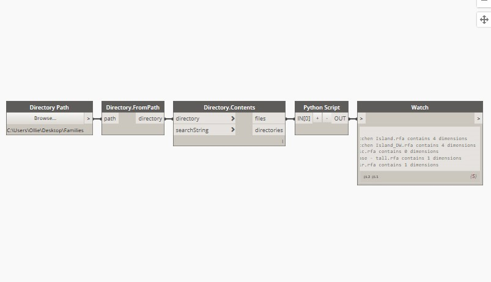

# 2.9 批处理文档

批处理Revit文件 Revit API的最强大功能之一就是能够以自动方式打开，关闭，编辑和保存文档。最重要的是，我们可以“无头”实现这一目标，这意味着无需任何GUI组件即可打开Revit文档的数据库。一般而言，以这种方式处理文档可能比用户这样做快20到30倍-这意味着构建涉及快速批处理许多文件时可以使用这种方式。

* **批处理步骤**：
  * 根据目标文档的文件路径，创建 **Revit FilePath** 对象的列表，遍历此文档路径列表
  * 使用Revit API的 **Open()** 方法打开文件并为此打开的文档创建一个句柄
  * 通过其句柄打开针对我们新打开的文档的处理
  * 根据需求进行API调用，具体取决于要执行的具体操作
  * 关闭打开文档。如果需要保存更改，可将文档进行另存。

## python 节点代码

```python
input_paths = IN[0]
# 设置打开方式
open_options = OpenOptions()
report = []

for path in input_paths:
    filepath = FilePath(path)
    # 打开文件
    family_doc = app.OpenDocumentFile(filepath, open_options)
    dimensions = FilteredElementCollector(family_doc).OfCategory(BuiltInCategory.OST_Dimensions).WhereElementIsNotElementType().ToElements()
    number_dimensions = len(dimensions)
    report.append("File {} contains {} dimensions".format(path, number_dimensions))
    # 关闭文件
    family_doc.Close(False)
OUT = report #Outputting the report we generated
```

## dynamo节点


